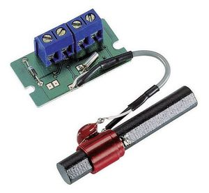
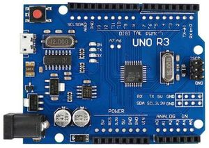
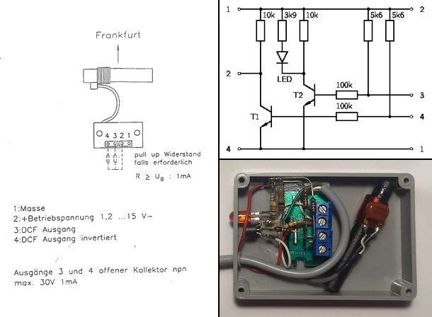
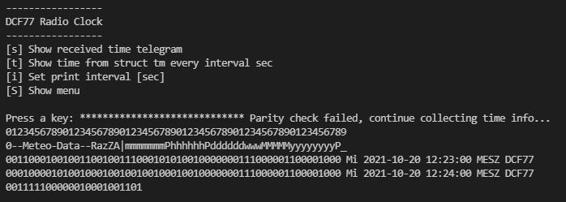
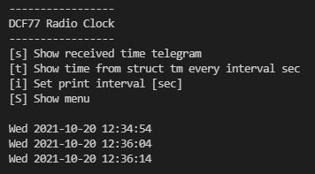

# Decoding the time signal of DCF77

Years ago, when accurate time sources were not easily available, 
I programmed a decoder for the time signal of the time signal 
transmitter DCF77. This transmitter is located near Frankfurt, 
Germany, and is also easily received in Switzerland. This program 
decoded on a Windows system the digital output signal of the 
receiver connected to the gameport. For the sheer joy of 
experimenting, I have now rewritten the program for the Arduino Uno. 

## Parts
- DCF77 Receiver Module

 

- Arduino UNO R3

The receiver module has 2 open collector outputs, one of which
 provides an inverted signal. For the gameport I had built a 
 decoupling circuit with 2 transistors. One transistor drives an LED 
 which flashes every second and the other one supplies the positive 
 second pulses. I used the same circuit for operation with the 
 Arduino, although an input with pullup could also be connected 
 directly to the output of the receiver module.

## Program
The decoding of the DCF77 time signal has already been described by many other authors and information about it can be found on the Internet.
- References
  - [DCF77 english wiki](https://en.wikipedia.org/wiki/DCF77)
  - [PTB Mitteilungen](https://oar.ptb.de/files/download/56d6a9c0ab9f3f76468b45a7)
  - [PTB DCF77 time code](https://www.ptb.de/cms/en/ptb/fachabteilungen/abt4/fb-44/ag-442/dissemination-of-legal-time/dcf77/dcf77-time-code.html)
  - [C-MAX Facts about DCF77](http://www.c-max-time.com/tech/dcf77.php)

## User Interface

The program is operated via a CLI menu.

After a parity error the bit numbering and the scheme of the time telegram 
is displayed. Then the incoming bits are displayed and at the end of the
full minute the time information in plain text.

If the `[t]` key is now pressed, the mode changes and the time information is 
displayed every 5 seconds. This interval can be changed with key `[i]`.

